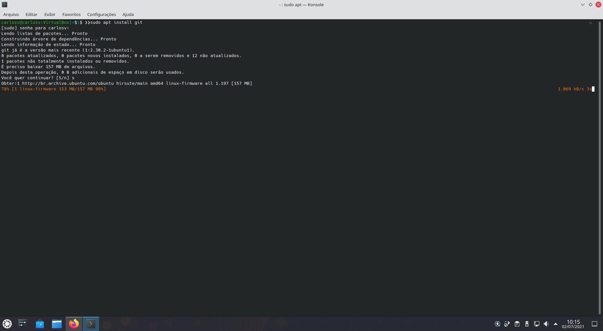

<p align="center">

</p>


[](https://github.com/carlosvitr/lemon_theme)

<a href="http://carlosvitor.ml/"></a>


<h1 align="center" > Lemon <a href="http://zsh.org/">Zsh</a></h1>

---

## Screenshot

<p align="center">

</p>

## Demonstration of Theme

<p align="center">

</p> 


---

## Install using Git 

If you are a git user, you install by cloning the repository:

```
$ git clone https://github.com/CarlosVitr/Lemon_zsh.git
```
And create a symbolic link to the oh-my-zsh theme folder:

```
$ ln -s $LEMON_THEME/Lemon.zsh-theme 
$OH_MY_ZSH/themes/Lemon.zsh-theme
```

PS: Remember that you must replace $ LEMON_THEME and $ OH_MY_ZSH with the actual directories for this command to work.

## Install Manually

- 1 - Download using the <a href="https://github.com/CarlosVitr/Lemon_theme/archive/refs/heads/main.zip"> download GitHub .zip </a> option and unzip them. 

- 2 - Move ``` Lemon.zsh-theme``` file to oh-my-zsh theme's folder: ```oh-my-zsh/themes/Lemon.zsh-theme.```

## Activating theme 

Go to your `~ / .zshrc` file and set `ZSH_THEME = "Lemon"`.

## Contributing

Contributions are always welcome. There are several ways to contribute to this project, such as:

- 🛠Porting this theme to other applications (ask first, please). 
- 🤜Requesting a port. 
- 🐞Reporting a bug. 
- 📘Improve this documentation. 
- 🤓👉🤓Sharing this project and recommending it to your friends. 
- 🌟Dropping a star in this repository. 

## 🐞 Bugs

Please file an issue for bugs, missing documentation, or unexpected behavior.
<p align="center">
<a href="https://github.com/CarlosVitr/Lemon_zsh/issues"></a>
</p>

# Author
 
| [](https://github.com/carlosvitr)|
| ---------------------------------------------|
| [Carlos Vítor](https://github.com/carlosvitr)|

# License

**Lemon Zsh©** <a href="http://carlosvitor.ml">Carlos Vítor</a>, Launched under the [GPL-3.0 License](https://github.com/CarlosVitr/Lemon_zsh/blob/main/LICENSE). Authored and maintained by Carlos Vítor with the help of <a href="https://github.com/carlosvitr/lemon_zsh/graphs/contributors">collaborators</a>.
> Github:<a href="https://github.com/carlosvitr">@CarlosVitr</a> • Twitter:<a href="https://twitter.com/ClsVitor">@ClsVitor</a> • LinkedIn:<a href="https://linkedin.com/in/CarlosVitor">Carlos Vítor</a>.
